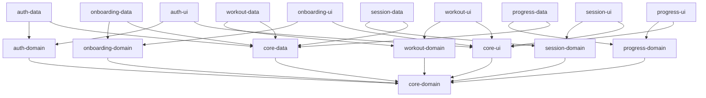
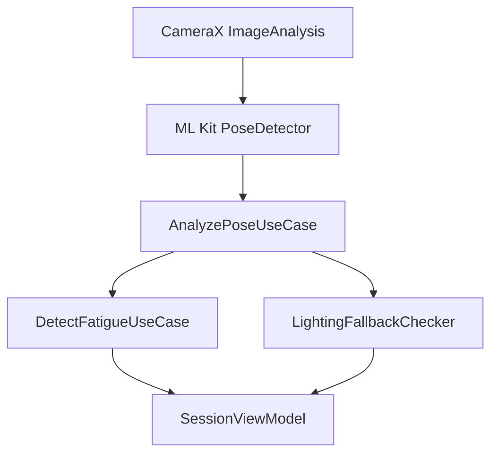
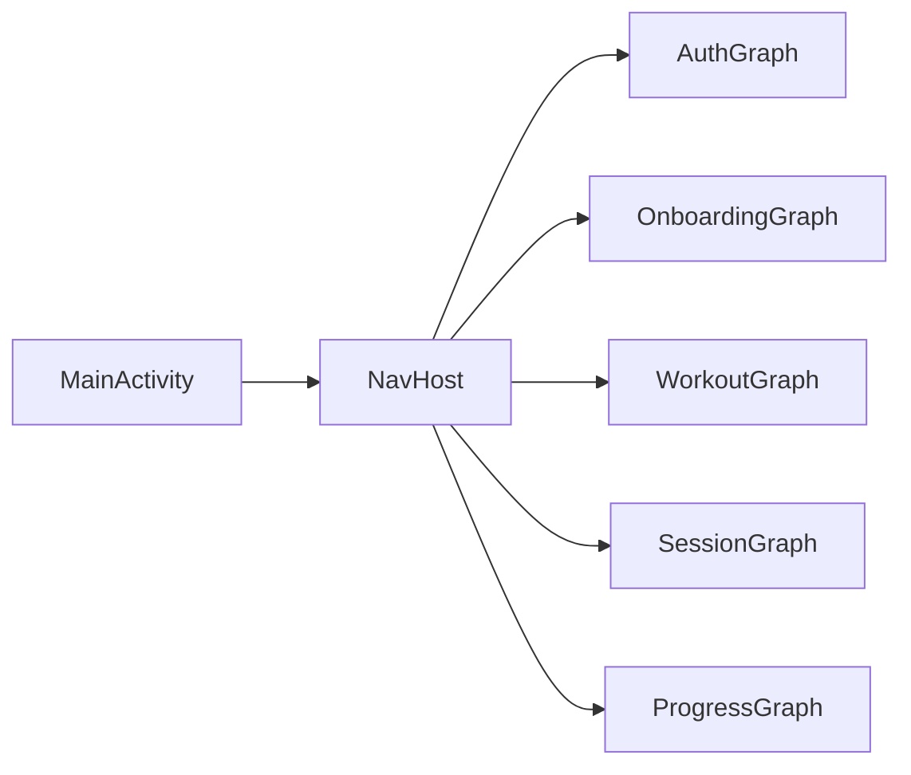

# FitLife – Architecture Document (v1)

---

## 1. Module Structure & Gradle Dependency Graph

**Gradle Settings (`settings.gradle.kts`):**
```kotlin
include(":app")
include(":core:core-data")
include(":core:core-domain")
include(":core:core-ui")

include(":feature:auth:auth-data")
include(":feature:auth:auth-domain")
include(":feature:auth:auth-ui")

include(":feature:onboarding:onboarding-data")
include(":feature:onboarding:onboarding-domain")
include(":feature:onboarding:onboarding-ui")

include(":feature:workout:workout-data")
include(":feature:workout:workout-domain")
include(":feature:workout:workout-ui")

include(":feature:session:session-data")
include(":feature:session:session-domain")
include(":feature:session:session-ui")

include(":feature:progress:progress-data")
include(":feature:progress:progress-domain")
include(":feature:progress:progress-ui")
```

**Dependency Graph (Mermaid):**


*All **core-*** modules are independent of feature modules. Feature modules depend only on core modules and their own sibling layers.

---

## 2. MVI Implementation Example (Workout Feature)

### State
```kotlin
data class WorkoutState(
    val plan: WorkoutPlan? = null,
    val isLoading: Boolean = false,
    val errorMessage: String? = null
) : UIState
```

### Event
```kotlin
sealed class WorkoutEvent : Event {
    data class LoadPlan(val profile: UserProfile) : WorkoutEvent()
    object Refresh : WorkoutEvent()
}
```

### One‑Time Action
```kotlin
sealed class WorkoutAction : OneTimeAction {
    data class ShowError(val message: String) : WorkoutAction()
    data class NavigateToSession(val planId: String) : WorkoutAction()
}
```

### ViewModel
```kotlin
@HiltViewModel
class WorkoutViewModel @Inject constructor(
    private val generatePlanUseCase: GenerateWorkoutPlanUseCase
) : MVIBaseViewModel<WorkoutState, WorkoutEvent, WorkoutAction>() {

    override fun createInitialState() = WorkoutState()

    override fun onEvent(event: WorkoutEvent) {
        when (event) {
            is WorkoutEvent.LoadPlan -> fetchPlan(event.profile)
            WorkoutEvent.Refresh -> state.value.plan?.let { fetchPlan(it.profile) }
        }
    }

    private fun fetchPlan(profile: UserProfile) {
        setState { copy(isLoading = true, errorMessage = null) }
        viewModelScope.launch {
            when (val result = generatePlanUseCase(profile)) {
                is Result.Success -> setState { copy(plan = result.data, isLoading = false) }
                is Result.Error -> {
                    setState { copy(isLoading = false) }
                    sendAction(WorkoutAction.ShowError(result.error::class.simpleName ?: "Error"))
                }
            }
        }
    }
}
```

### Compose Screen (collecting state)
```kotlin
@Composable
fun WorkoutScreen(viewModel: WorkoutViewModel = hiltViewModel()) {
    val state by viewModel.state.collectAsState()
    LaunchedEffect(Unit) {
        viewModel.action.collect { action ->
            when (action) {
                is WorkoutAction.ShowError -> {
                    // show snackbar with action.message
                }
                is WorkoutAction.NavigateToSession -> {
                    // Navigate to session screen, assuming navController is available
                    navController.navigate("session/${action.planId}")
                }
            }
        }
    }

    // UI rendering based on `state`
    // Handle one‑time actions (e.g., Snackbar) when `action` changes
}
```

---

## 3. Room Database Schema

| Entity | Table Name | Primary Key | Columns (type) |
|--------|------------|-------------|----------------|
| User | users | userId (String) | name, email, age, fitnessLevel, createdAt |
| WorkoutPlan | workout_plans | planId (String) | userId (FK), level, location, jsonPayload |
| Session | sessions | sessionId (String) | userId (FK), planId (FK), startTime, endTime, fatigueFlag |
| Exercise | exercises | exerciseId (String) | name, description, videoUrl |
| SessionExerciseCrossRef | session_exercise_cross_ref | composite (sessionId, exerciseId) | orderIdx, reps, sets |

**DAO Examples**
```kotlin
@Dao
interface WorkoutPlanDao {
    @Insert(onConflict = OnConflictStrategy.REPLACE)
    suspend fun insert(plan: WorkoutPlanEntity)

    @Query("SELECT * FROM workout_plans WHERE userId = :userId ORDER BY createdAt DESC LIMIT 1")
    suspend fun getLatestPlan(userId: String): WorkoutPlanEntity?
}
```

---

## 4. Firestore Collections Structure & Sync Strategy

- **Root collection:** `users/{userId}`
    - Sub‑collection `workoutPlans` → mirrors Room `workout_plans`
    - Sub‑collection `sessions` → mirrors Room `sessions`
    - Document fields: same as Room columns (JSON compatible)

**Sync Strategy**
1. Write to Room first (source of truth).
2. Use a `WorkManager`‑backed sync worker that watches Room changes via `Flow`.
3. When online, the worker uploads/updates the corresponding Firestore document.
4. Conflict resolution: latest‑timestamp wins; server timestamps are stored for reconciliation.

---

## 5. Repository Interfaces (Domain Layer)

```kotlin
interface IAuthRepository : IBaseRepository {
    suspend fun signIn(email: String, password: String): Result<User, NetworkErrors>
    suspend fun signInWithGoogle(token: String): Result<User, NetworkErrors>
    suspend fun signOut(): Result<Unit, NetworkErrors>
    suspend fun getCurrentUser(): Result<User?, NetworkErrors>
}
```

```kotlin
interface IWorkoutRepository : IBaseRepository {
    suspend fun generatePlan(profile: UserProfile): Result<WorkoutPlan, NetworkErrors>
    suspend fun getCachedPlan(userId: String): Result<WorkoutPlan?, NetworkErrors>
    suspend fun savePlan(plan: WorkoutPlan): Result<Unit, NetworkErrors>
}
```

Similarly for `ISessionRepository`, `IProgressRepository`, `IOnboardingRepository` – each returning `Result` wrapped types.

---

## 6. Use‑Case Implementations (Domain)

### Example: GenerateWorkoutPlanUseCase
```kotlin
class GenerateWorkoutPlanUseCase @Inject constructor(
    private val repository: IWorkoutRepository,
    private val fallbackAssetProvider: AssetProvider // reads assets/fallback_workout_plans.json
) {
    suspend operator fun invoke(profile: UserProfile): Result<WorkoutPlan, NetworkErrors> {
        // 1️⃣ Try Gemini API via repository (which itself calls safeCall etc.)
        return when (val apiResult = repository.generatePlan(profile)) {
            is Result.Success -> apiResult
            is Result.Error -> {
                // 2️⃣ If API fails or latency >5s, load local fallback
                val fallback = fallbackAssetProvider.loadFallbackPlan(profile.fitnessLevel, profile.location)
                fallback?.let { Result.Success(it) }
                    ?: Result.Error(NetworkErrors.UnknownApiError)
            }
        }
    }
}
```

Other use‑cases follow the same **single‑operator‑fun `invoke()`** pattern and depend only on repository interfaces.

---

## 7. ML Kit Pose Detection Pipeline



**Key steps:**
1. `CameraX` provides `ImageProxy` frames.
2. `PoseDetector.process(image)` returns `Pose` (on‑device).
3. `AnalyzePoseUseCase` extracts joint angles, builds a `PoseData` object.
4. `DetectFatigueUseCase` compares current rep angles against baseline (first two reps) and flags fatigue when deviation > threshold for ≥3 consecutive reps.
5. `LightingFallbackChecker` evaluates `pose.confidence` (< 0.6) and ambient light sensor (or frame brightness) to trigger audio‑only mode with a 2‑second debounce.

---

## 8. Fatigue Detection Algorithm

1. **Baseline collection:** First two reps – compute average joint angles (`baselineAngles`).  
2. **Per‑rep analysis:** For each subsequent rep, compute `delta = |currentAngles - baselineAngles|` per joint.
3. **Threshold:** If > 15° on any major joint **and** this occurs for three consecutive reps → `fatigueDetected = true`.
4. **Action:** Emit `FatigueEvent` through the MVI `OneTimeAction` channel; UI shows warning and logs to analytics.

---

## 9. Lighting Detection Trigger

- **Confidence check:** `pose.confidence < 0.6`.
- **Ambient light:** Compute average pixel brightness; if `< 10 lux`.
- **Debounce:** Wait 2 seconds of sustained low confidence/light before switching.
- **User override:** Bottom‑sheet toggle in UI that forces audio mode or restores visual mode.

---

## 10. Gemini API Integration Flow

1. **Prepare prompt** – JSON template with fields `{age, weight, goals, level, location}`.
2. **Call Gemini API** via Retrofit service (`GeminiApiService.generatePlan(request)`).
3. **Timeout handling:** Use `withTimeout(5000)`; if exceeds, treat as failure.
4. **Response parsing:** Gson → `GeminiPlanResponse` → map to domain `WorkoutPlan`.
5. **Caching:** Before API call, `Room` is queried for a cached plan for the same profile; if found and < 24 h old, return it.
6. **Fallback:** On API failure or latency > 5 s, load local JSON asset `assets/fallback_workout_plans.json` (see Q2) and select matching plan.
7. **Retry:** Exponential back‑off (1 s, 2 s, 4 s) up to 3 attempts, then fallback.

---

## 11. Navigation Graph Structure

- **Single Activity (`MainActivity`)** hosts a `NavHost`.
- **Feature NavGraphs** (`auth_graph`, `onboarding_graph`, `workout_graph`, `session_graph`, `progress_graph`).
- **Bottom Navigation** with four tabs (Home, Session, Progress, Profile) each linked to the top‑level destinations of the corresponding feature graph.



Deep links are defined for sharing a plan (`app://fitlife/plan/{planId}`) and for session resume.

---

## 12. Week 1 Technical Spikes

| Spike | Goal | Pass Criteria | Fail Action |
|-------|------|----------------|------------|
| **Spike 1 – ML Kit performance** | Verify ≥ 15 fps pose detection on Snapdragon 6xx | ≥ 15 fps in good lighting for 5 min continuous run | Defer pose detection to v1.1, launch with audio‑only guidance |
| **Spike 2 – Gemini API latency** | Confirm < 5 s plan generation on free tier | Average < 5 s over 10 calls, 95 % success | Implement static fallback templates as primary source |
| **Spike 3 – Room + Firestore sync** | Validate offline‑first pattern (Room write → Firestore sync) | Data persists offline, syncs when network restored, no conflicts | Use Firestore only (no offline) and note in scope |

---

## 13. Open Questions (Answered)

| Question | Answer |
|----------|--------|
| Gradle module versioning | Flat module names as listed in **Q1**. |
| Gemini API fallback format | Local JSON asset `assets/fallback_workout_plans.json` (see **Q2**). |
| Pose confidence threshold | 0.6 with 2‑second debounce (**Q3**). |
| Background worker for fatigue detection | Handled via coroutine in Session ViewModel (**Q4**). |
| Hilt module naming | Use `CoreDataModule`, `NetworkModule`, `AuthModule`, `WorkoutModule`, `SessionModule`, `OnboardingModule`, `ProgressModule` (**Q5**). |

---

**Document generated automatically per user approval.**
