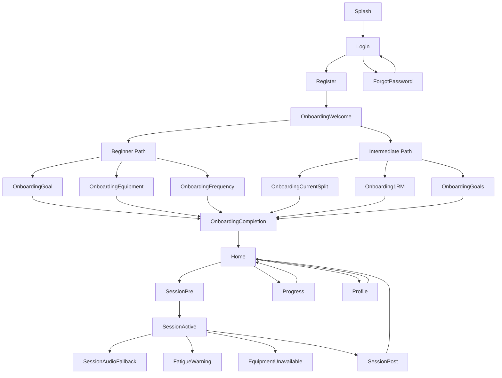

# FitLife UX Specification (v1.0)

**Project:** FitLife — AI Personal Health Coach
**Platform:** Android (Jetpack Compose)
**Target Market:** Egypt / MENA
**Design System:** Arctic Focus (see color palette below)

---

## 1. Screen Flow Diagram

---

## 2. Design Tokens
### Color Palette – *Arctic Focus*
| Role | Hex |
|------|-----|
| **Primary** | `#0288D1` |
| Primary Light | `#4FC3F7` |
| Primary Dark | `#01579B` |
| **Accent** | `#00BCD4` |
| Accent Light | `#B2EBF2` |
| **Background** | `#F0F4F8` |
| **Surface** | `#FFFFFF` |
| Surface Elevated | `#E8EEF4` |
| On Background / On Surface | `#1A1A2E` |
| On Primary | `#FFFFFF` |
| Secondary Text | `#546E7A` |
| Divider | `#ECEFF1` |
| Border | `#CFD8DC` |
| Success | `#2E7D32` |
| Warning | `#F57C00` |
| Error | `#C62828` |
| **Pose Overlay (Session only)** |
| Joint Correct | `#00BCD4` |
| Joint Warning | `#F57C00` |
| Joint Error | `#C62828` |
| Skeleton Line (40% opacity) | `#66FFFFFF` |
| **Session Dark Theme** |
| Background | `#000000` |
| Surface | `#0D1117` |
| Accent | `#00BCD4` |
| Text | `#FFFFFF` |
---
### Typography – *Inter*
| Role | Size | Weight |
|------|------|--------|
| Display | 57sp | Bold |
| Headline | 32sp | SemiBold |
| Title | 22sp | SemiBold |
| Body | 16sp | Regular |
| Caption | 12sp | Regular |
---
### Touch Targets
- General UI: **48dp × 48dp** minimum
- Session controls (pause/stop/start): **64dp × 64dp** minimum
---
## 3. Per‑Screen Specification
### 3.1 Splash & Auth Screens
#### Splash Screen
- **Layout:** Full‑screen column, centered brand logo (120dp) with animated shimmering background using `primaryLight` gradient.
- **Key Components:** `Logo`, `CircularProgressIndicator` (primary accent).
- **States:** Loading only.
- **Interactions:** None.

#### Login Screen
- **Layout:** Column, vertical spacing 16dp.
- **Key Components:** `GoogleSignInButton`, `EmailField`, `PasswordField`, `LoginButton`, `ForgotPasswordLink`, `RegisterLink`.
- **States:** Normal, Loading (spinner on button), Error (snackbar with `error` color).
- **Interactions:** Google OAuth, login request, navigation to Forgot/Register.

#### Register Screen
- Same layout as Login, adds `ConfirmPasswordField` and optional `NameField`.
- Validation errors highlighted with `error` color.

#### Forgot Password Screen
- **Layout:** Email input + `SendResetButton`.
- **States:** Normal, Sending (spinner), Sent (success snackbar), Error.
---
### 3.2 Onboarding Screens
#### Welcome / Level Selector
- **Layout:** Horizontal pager with two `LevelCard`s (Beginner, Intermediate). Each card shows illustration, description, `SelectButton`.
- **Components:** `LevelCard`, `PagerIndicator`.
- **States:** Idle, Selected (elevated + accent border).
- **Interactions:** Swipe, tap Select → store level, navigate.

#### Beginner Path (max 5 screens)
1. **Goals** – multi‑select chips (primary accent).
2. **Equipment** – toggle list with icons.
3. **Frequency** – slider (24‑hour range).
4. **(Optional) Additional Info** – free‑text note.
5. **Completion** – summary card + `FinishButton`.
- **Common Layout:** Headline, description, component list, bottom `Next` button.
- **States:** Normal, Loading (if fetching suggestions), Error (network).

#### Intermediate Path (max 5 screens)
1. **Current Split** – list of split templates.
2. **Goals** – same as beginner.
3. **1RM (optional)** – numeric input with unit picker.
4. **Equipment** – same as beginner.
5. **Completion** – summary.
- **Interactions:** Selecting split auto‑populates suggested exercises.
---
### 3.3 Home Screen (Workout Plan)
- **Layout:** Scaffold with BottomNavigation (primary active tab). Top app bar "Workout Plan".
- **Components:** `TodayWorkoutCard`, `WeeklyPlanOverview`, `LoadingOverlay`, `EmptyStateView`, `ErrorStateView`.
- **States:**
  - **Success:** Shows card with CTA "Start Session".
  - **Loading:** Full‑screen spinner overlay.
  - **Empty:** Illustration + `CreatePlanButton`.
  - **Error:** Banner (warning color) with retry.
- **Interactions:** Tap card → Session Pre‑screen; pull‑to‑refresh regenerates plan.
---
### 3.4 Session Screen (most complex)
#### Pre‑Session
- **Layout:** Column with `ExerciseListPreview` (lazy column) and `StartButton` (64dp, primary accent).
- **States:** Normal, Loading (exercise details).
- **Interactions:** Tap exercise for details, long‑press reorder (optional), tap Start → Active Session.

#### Active Session
- **Theme:** `SessionTheme` (dark/black).
- **Background:** `CameraXPreview` full‑screen.
- **Overlay Layers:**
  1. **SkeletonOverlay** – joints colored (correct cyan, warning orange, error red) with 40% opacity lines.
  2. **RepCounter** – large Inter 57sp bold, top‑right, white.
  3. **SetCounter** – smaller, top‑left.
  4. **ExerciseName** – middle top, headline style.
  5. **Controls** – pause, stop, audio‑mode toggle (64dp circles, primary accent) with 300ms ripple.
- **States:** Active, Paused (semi‑transparent overlay), Audio‑Fallback (dark theme, minimal UI + waveform Lottie), Error (camera failure dialog).
- **Interactions:** Pause, Stop, Toggle audio, no interaction on overlay.

#### Fatigue Warning Overlay
- Slides up from bottom (300ms ease‑out) using `AnimatedVisibility`.
- Contains warning text (orange), `DismissButton` (primary) and optional audio alert.

#### Equipment Unavailable Bottom Sheet
- Triggered by one‑tap button on session screen.
- ModalBottomSheet with three `AlternativeCard`s (elevation, primary border). Each shows image, name, `Select` CTA.
- Selecting replaces current exercise.

#### Post‑Session Summary
- **Layout:** Column with metrics (reps, sets, duration, fatigue events) using `Title` + `Body` texts.
- **Components:** `ConfettiAnimation` (Lottie, 1 s), `ShareWhatsAppButton` (primary), `DoneButton` (primary).
- **States:** Success (confetti), Error (analytics fail message).
---
### 3.5 Progress Screen
- **Layout:** Scaffold, top app bar "Progress", vertical scroll.
- **Components:** `WeeklyStatsRow` (4 metric cards), `MPAndroidChartBar` (volume), `SessionHistoryList` (lazy column), `EmptyStateView`.
- **States:** Normal, Empty, Loading.
- **Interactions:** Tap chart bar → day‑view drill‑down; tap history item → session detail.
---
### 3.6 Profile Screen
- **Layout:** Column with avatar, info rows, edit goals, notification & audio switches, sign‑out, delete account.
- **Components:** `AvatarImage`, `InfoItem`, `Switch`, `DestructiveButton`.
- **States:** Normal, Loading (profile fetch), Error (snackbar).
- **Interactions:** Edit opens modal form, toggles update settings, sign‑out confirmation dialog, delete confirmation (destructive dialog).
---
## 4. Reusable Component Inventory
### Core UI (`core-ui/components/`)
| Component | Description | Screens Used |
|-----------|-------------|--------------|
| `PrimaryButton` | Filled primary button, disabled state, 300 ms ripple | Auth, Onboarding, Home, Session, Profile |
| `SecondaryButton` | Outlined button, secondary text color | Auth, Onboarding |
| `IconButton` | Circular tappable icon (min 48dp) | BottomNav, Session controls |
| `TextField` | Material input with helper/error text | Auth, Register, Forgot, Profile edit |
| `ChipGroup` | Single/multi selectable chips | Onboarding goals/equipment |
| `LoadingOverlay` | Full‑screen dim + spinner | Home, Onboarding, Session pre‑load |
| `ErrorBanner` | Top warning banner with retry | Home, Session error states |
| `BottomNavigationBar` | 4‑tab navigation component | All main screens |
| `SkeletonOverlay` | Pose skeleton drawing (configurable colors) | Session (active) |
| `BottomSheet` | Draggable modal sheet | Session equipment sheet |
| `LottieAnimation` | Wrapper for Lottie JSON assets | Exercise demos, Confetti |
| `Divider` | Thin line using divider color | List items |
| `Card` | Elevated surface with ripple | Home cards, Progress cards, Post‑session |
| `AlertDialog` | Confirmation dialog with destructive style | Delete account, sign‑out |
---
### Feature‑Specific (`features/<feature>/components/`)
| Feature | Component | Description |
|--------|-----------|-------------|
| Auth | `GoogleSignInButton` | Google OAuth styled button |
| Auth | `AuthErrorSnackbar` | Snackbar for auth errors |
| Onboarding | `LevelCard` | Card for Beginner/Intermediate selection |
| Onboarding | `GoalSelectionScreen` | Screen with `ChipGroup` for goals |
| Session | `CameraPreview` | Compose wrapper for CameraX preview |
| Session | `RepCounterOverlay` | Large rep counter overlay |
| Session | `FatigueBanner` | Sliding warning banner |
| Progress | `MPChartBar` | Compose wrapper around MPAndroidChart bar chart |
| Profile | `ProfileEditForm` | Modal form for editing user info |
---
## 5. Accessibility Checklist
- **Contrast:** All text/background combos meet WCAG AA (≥4.5:1) using palette colors.
- **Touch Targets:** Minimum 48dp, 64dp for session controls.
- **Content Descriptions:** All icons/images have `contentDescription`.
- **Screen Reader:** Buttons use `semantics { role = Role.Button }`; counters expose `stateDescription`.
- **Dynamic Text Scaling:** `sp` units used throughout; layouts adapt to `fontScale`.
- **Focus Order:** Logical top‑to‑bottom; dialogs request focus.
- **Error Announcements:** `ErrorBanner` uses `LiveRegionMode.Polite`.
- **Haptic Feedback:** Optional for pause/stop (respect user setting).
- **RTL Support:** Layouts use `start`/`end` paddings; no hard‑coded left/right. RTL will be enabled in v1.1.
- **Low‑Lighting:** Session dark theme ensures high contrast; overlay colors visible on black.
---
*Document generated by the BMad UX Designer (Sally) on 2026‑05‑31.*
